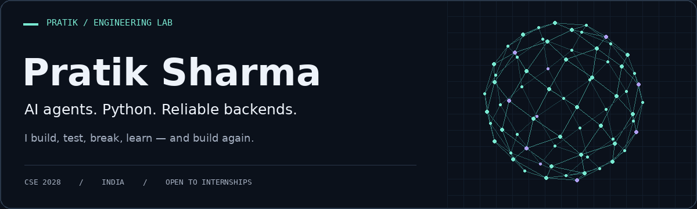
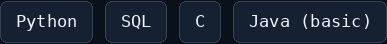
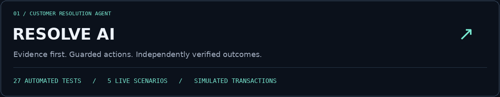
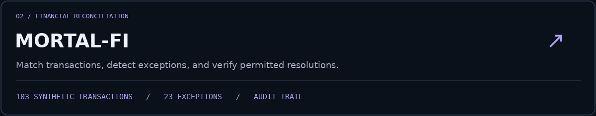

  

  <a href="https://pratik0sharma.github.io/"><b>Portfolio ↗</b></a> &nbsp; / &nbsp;
  <a href="https://www.linkedin.com/in/pratik-sharma-a2100b2a4/"><b>LinkedIn</b></a> &nbsp; / &nbsp;
  <a href="mailto:pratik05csebranch@gmail.com"><b>Email</b></a> &nbsp; / &nbsp;
  <a href="https://leetcode.com/u/PRATIK0_0SHARMA/"><b>LeetCode</b></a> &nbsp; / &nbsp;
  <a href="https://www.hackerrank.com/profile/sharmapriyank141"><b>HackerRank</b></a>

<!-- Add your portfolio here once its public URL is ready. The current private preview is intentionally not linked. -->

### `01 / about.me`

I'm a **Computer Science student at Cooch Behar Government Engineering College**, graduating in **2028**. I enjoy taking a practical problem and turning it into software I can test, explain, and improve.

My strongest language is **Python**. My projects explore **AI agents, backend development, and machine learning**, with a particular interest in checking what happens before and after an automated action.

- **400+** problems solved on LeetCode and a **5-star Python** rating on HackerRank.
- Building experience with APIs, databases, automated tests, and guarded AI workflows.
- Open to **AI engineering and software development internships**.

### `02 / tech.stack`

**Languages**

**AI & machine learning**

**Backend & applications**

**Data & visualisation**

### `03 / featured.projects`

An AI agent that retrieves **customer, order, inventory, and policy data**, then performs a permitted simulated replacement, refund, or cancellation.

- Checks evidence and policy before acting; prevents duplicate actions.
- Recovers from stock failures and independently verifies the resulting state.
- Validated with **27 automated tests and 5 live scenarios**; deployed with session-isolated databases and API retry handling.

**Stack:** Python · SQLite · Streamlit · Groq API · Ollama · LLM tool calling

**[Try the live demo ↗](https://resolveai-iib.streamlit.app/)** &nbsp; · &nbsp; **[Explore the source ↗](https://github.com/PRATIK0SHARMA/RESOLVE_AI)**

<b>Inside the workflow</b>

1. Retrieve the relevant order, customer, inventory, and policy records.
2. Check whether the requested action is eligible.
3. Execute a guarded action, or recover if the preferred path is blocked.
4. Verify the state change and record the result.

The demo records simulated transactions. It does not move real money.

 

A financial reconciliation prototype that detects transaction exceptions and resolves validated low-risk cases with rule-based guardrails.

- Processed **103 synthetic transactions** and detected **23 exceptions**.
- Combines data processing, AI reasoning, guarded actions, and an audit trail.
- Achieved **100% post-execution verification on the synthetic test dataset**; this is not a production accuracy claim.

**Stack:** Python · FastAPI · Streamlit · Pandas · NumPy · Plotly · REST APIs

**[Explore the source ↗](https://github.com/PRATIK0SHARMA/MORTAL-FI)**

<b>Other things I've built</b>

**FastAPI Blogs** — a blogging backend with secure user authentication and post management.

**AGRI AI** — a machine learning project for crop recommendations and plant disease detection using image recognition and predictive analytics.

[Browse my repositories ↗](https://github.com/PRATIK0SHARMA?tab=repositories)

### `04 / learning.log`

**Coursework:** Data Structures & Algorithms · Hugging Face Large Language Model course · Jovian Machine Learning

**Hackathons & problem solving:** Selected for the 24-hour INIZIO hackathon at IIIT Guwahati · Top 5 in the TECHNOVISTA coding competition (2024) · Participated in SIH 2024 and 2025

---

<b>Have an interesting problem or an internship opportunity?</b> 
<a href="mailto:pratik05csebranch@gmail.com">Let's talk → pratik05csebranch@gmail.com</a>

Curious by default. Always building.

